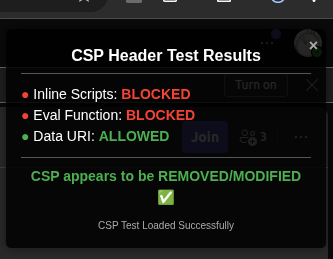
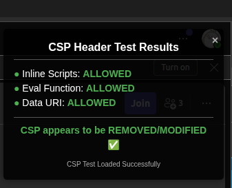

# Chrome拡張機能の権限解析：declarativeNetRequestWithHostAccessを使用したコンテンツセキュリティポリシー（CSP）の変更

## はじめに

コンテンツセキュリティポリシー（Content Security Policy、略称CSP）は、Webサイトがさまざまな種類の攻撃、特にクロスサイトスクリプティング（XSS）攻撃を軽減するのに役立つ重要なセキュリティメカニズムです。Chrome拡張機能の`declarativeNetRequestWithHostAccess`権限と`declarative_net_request`APIを組み合わせることで、これらのセキュリティヘッダーを変更する強力な方法が提供されます。このブログでは、デモプロジェクトを通してこの機能の実装と応用シナリオを詳細に分析します。

## CSPの概要

コンテンツセキュリティポリシーは、ロード可能なリソースのソースを定義することで、Webページが実行できる操作を制限します。例えば：
- インラインJavaScriptの実行を禁止
- `eval()`関数の使用を阻止
- 特定のドメインからのリソースロードを制限
- データURIからのリソースロードをブロック

これらの制限により、悪意のあるコードの注入と実行を効果的に防ぎ、Webサイトのセキュリティを向上させることができます。

## Chrome拡張機能の権限解析

### declarativeNetRequestWithHostAccess

この権限はChrome拡張機能の強力な権限であり、リクエストの内容を読み取ることなく、特定のホストのネットワークリクエストとレスポンスヘッダーを変更することができます。その特徴は：

1. **宣言型であり手続き型ではない**：拡張機能はリアルタイムでコードを実行するのではなく、あらかじめルールを定義します
2. **プライバシー保護**：リクエストの完全な内容へのアクセスが不要
3. **効率的**：ルールがあらかじめ定義されているため、実行効率が高い

### declarative_net_request API

このAPIにより、拡張機能は事前定義されたルールセットを通じてネットワークリクエストを変更できます。サンプルプロジェクトでは、このAPIを使用してCSPヘッダーを削除しています：

```json
{
  "declarative_net_request": {
    "rule_resources": [
      {
        "id": "ruleset_1",
        "enabled": true,
        "path": "rules_1.json"
      }
    ]
  }
}
```

## プロジェクト構造の分析

### manifest.json

```json
{
  "manifest_version": 3,
  "name": "CSP Inspector & Modifier",
  "version": "1.0",
  "description": "Tests and modifies Content Security Policy (CSP) headers for web application testing and development",
  "permissions": [
    "declarativeNetRequestWithHostAccess"
  ],
  "host_permissions": [
    "https://teams.live.com/*"
  ],
  "declarative_net_request": {
    "rule_resources": [
      {
        "id": "ruleset_1",
        "enabled": true,
        "path": "rules_1.json"
      }
    ]
  },
  "content_scripts": [
    {
      "matches": ["https://teams.live.com/*"],
      "js": ["content.js"],
      "run_at": "document_idle"
    }
  ],
  "web_accessible_resources": [
    {
      "resources": ["csp-test-manual.js"],
      "matches": ["https://teams.live.com/*"]
    }
  ]
}
```

このファイルは拡張機能の基本情報、必要な権限、およびリソースを定義しています。重要なポイント：
- `declarativeNetRequestWithHostAccess`権限を使用
- ターゲットホストとして`https://teams.live.com/*`を指定
- ルールセットリソースを定義

### rules_1.json

```json
[
  {
    "id": 1,
    "priority": 1,
    "action": {
      "type": "modifyHeaders",
      "responseHeaders": [
        { "header": "cache-control", "operation": "remove" },
        { "header": "content-security-policy", "operation": "remove" },
        { "header": "content-security-policy-report-only", "operation": "remove" },
        { "header": "x-my-header", "operation": "set", "value": "true" }
      ]
    },
    "condition": {
      "urlFilter": "https://teams.live.com/*"
    }
  },
  {
    "id": 2,
    "priority": 2,
    "action": {
      "type": "modifyHeaders",
      "responseHeaders": [
        { "header": "x-second-header", "operation": "set", "value": "test" }
      ]
    },
    "condition": {
      "domains": ["teams.live.com"],
      "urlFilter": "https://teams.live.com/*"
    }
  }
]
```

このファイルは2つのルールを定義しています：
1. **最初のルール**：3つの特定のヘッダー（cache-control、content-security-policy、content-security-policy-report-only）を削除し、カスタムヘッダーを追加
2. **2番目のルール**：別のカスタムヘッダーを追加

各ルールには以下の要素が含まれています：
- **idとpriority**: 一意の識別子と優先順位
- **action**: 実行するアクション（ヘッダーの変更）
- **condition**: ルールを適用する条件（URLマッチングパターン）

### content.js

このスクリプトはコンテンツスクリプトであり、マッチするページ上で実行されます。主な機能は：
1. 拡張機能のWebアクセス可能リソースからスクリプト（csp-test-manual.js）を読み込む試み
2. スクリプトが正常に読み込まれたかを監視（CSPが変更されたかどうかによる）
3. テスト結果の表示（成功または失敗）

重要なコード部分：

```javascript
// テストスクリプトを読み込む試み
function loadTestScript() {
  try {
    const scriptURL = chrome.runtime.getURL('csp-test-manual.js');
    console.log('%cAttempting to load script from:', 'color: blue', scriptURL);
    
    const script = document.createElement('script');
    script.src = scriptURL;
    
    script.onload = () => {
      scriptLoaded = true;
      console.log('%cScript loaded successfully!', 'color: green; font-weight: bold');
    };
    
    script.onerror = (error) => {
      console.error('%cScript failed to load:', 'color: red', error);
      showResults(false, 'Script load error - CSP likely blocked it');
    };
    
    document.head.appendChild(script);
    
    setTimeout(() => {
      if (!scriptLoaded && !window.CSP_TEST_PASSED) {
        showResults(false, 'Script load timeout - CSP likely blocked it');
      }
    }, 2000);
    
  } catch (e) {
    console.error('Error setting up test script:', e);
    showResults(false, e);
  }
}
```

### csp-test-manual.js

これは最も重要なテストスクリプトで、CSPによって制限される3つの一般的な動作をテストします：
1. **インラインスクリプトの実行**: インラインスクリプトを作成して追加することで検出
2. **eval関数の実行**: eval関数の使用を試みることで検出
3. **データURI資源の読み込み**: データURIからのリソースが読み込めるかをテスト

重要なコード部分:

```javascript
// インラインスクリプト実行のテスト
function testCSPInlineScript() {
  try {
    const script = document.createElement('script');
    script.textContent = 'window.cspTestPassed = true;';
    document.head.appendChild(script);
    
    return window.cspTestPassed === true;
  } catch (e) {
    console.error("Error executing test script:", e);
    return false;
  }
}

// eval実行のテスト
function testCSPEval() {
  try {
    eval('window.evalTestPassed = true;');
    return window.evalTestPassed === true;
  } catch (e) {
    console.error("Error executing eval:", e);
    return false;
  }
}

// テストオーバーレイの削除
window.removeCSPTestOverlay = function() {
  // IDセレクタを使用して安全にオーバーレイを特定
  // 以前はスタイルマッチングセレクタを誤って使用していた
  const overlay = document.getElementById('csp-test-overlay');
  if (overlay) overlay.remove();
  console.log("CSP test overlay removed");
};
```

このスクリプトはまた、テスト結果を視覚的に表示するオーバーレイも作成します。

## 動作原理の詳細

1. **初期化フロー**:
   - ユーザーがターゲットWebサイト（https://teams.live.com/v2/）にアクセス
     - 注意：初回アクセス時は、documentタイプのリクエストに対するヘッダー変更は適用されません
   - ページを更新し、拡張機能のルールが完全に適用されることを確認
     - 更新後、documentタイプのリクエストにもヘッダー変更が適用されます
   - 拡張機能のルールが自動的に適用され、CSPヘッダーが削除される
   - content.jsが挿入され実行される

2. **テストプロセス**:
   - content.jsがcsp-test-manual.jsを読み込もうとする
   - CSPが正常に削除された場合、このスクリプトは読み込まれ実行される
   - csp-test-manual.jsは3つのテストを実行し、CSPが本当に削除または変更されたかを確認する

3. **結果表示**:
   - ページの右上にオーバーレイが表示され、テスト結果を示す
   - コンソールに詳細なテスト情報が出力される
   - CSPが正常に変更されたかどうかをマーク

### 効果比較

#### CSP有効時（変更前）



#### CSPが削除された後（変更後）



## 応用シナリオ

この技術は様々なシナリオに応用できます：

1. **開発テスト**：開発プロセス中にCSPを一時的に無効化し、デバッグを容易にする
2. **セキュリティ研究**：WebサイトのCSPの実際の効果を分析する
3. **機能強化**：厳格なCSPを持つWebサイトで特定のサードパーティスクリプトが実行できるようにする
4. **企業内部ツール**：内部ツールをサポートするために社内WebサイトのCSPを修正する

## 注意事項とベストプラクティス

1. **慎重な使用**：この機能はWebサイトのセキュリティを弱める可能性があるため、慎重に使用すべき
2. **開発専用**：本番環境ではCSPの完全性を維持すべき
3. **正確なマッチング**：CSPの過剰な削除を避けるため、できるだけ正確なURLマッチングを使用する
4. **セキュリティ意識**：CSP削除の潜在的なリスクを理解する

## 結論

Chrome拡張機能の`declarativeNetRequestWithHostAccess`権限と`declarative_net_request` APIは、Webサイトのセキュリティヘッダーを変更する強力で柔軟な方法を提供します。この記事で分析したデモプロジェクトを通じて、CSPの変更効果を検出し検証するためにこれらの機能をどのように使用するかを見てきました。

この技術は開発者やセキュリティ研究者にとって強力なツールですが、Webサイトのセキュリティを低下させないように慎重に使用する必要があります。適切なルール設計と適切な使用シナリオの制限により、このネットワークセキュリティを維持しながらこの機能を十分に活用することができます。
