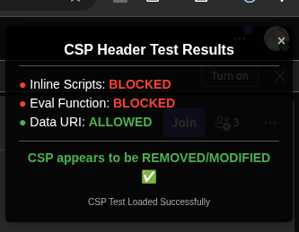
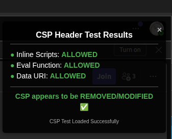

# Chrome Extension权限解析：使用declarativeNetRequestWithHostAccess修改内容安全策略(CSP)

## 简介

内容安全策略(Content Security Policy，简称CSP)是一种重要的安全机制，它可以帮助网站减轻各种类型的攻击，特别是跨站脚本攻击(XSS)。而Chrome扩展的`declarativeNetRequestWithHostAccess`权限结合`declarative_net_request`API提供了一种强大的方式来修改这些安全头信息。在本博客中，我们将通过一个演示项目详细分析这一功能的实现和应用场景。

## CSP简介

内容安全策略通过定义允许加载的资源的来源来限制网页可以执行哪些操作。例如，它可以：
- 禁止执行内联JavaScript
- 阻止使用`eval()`函数
- 限制从特定域加载资源
- 阻止使用data URI加载资源

这些限制可以有效防止恶意代码的注入和执行，提高网站的安全性。

## Chrome扩展权限解析

### declarativeNetRequestWithHostAccess

这个权限是Chrome扩展中的一个强大权限，允许扩展修改特定主机的网络请求和响应头信息，同时不需要读取请求内容。它的特点是：

1. **声明式而非程序式**：扩展预先定义规则，而不是实时执行代码
2. **保护隐私**：不需要访问请求的完整内容
3. **高效**：因为规则是预定义的，执行效率高

### declarative_net_request API

这个API允许扩展通过预定义的规则集来修改网络请求。我们的示例项目中，使用这个API来移除CSP头：

```json
{
  "declarative_net_request": {
    "rule_resources": [
      {
        "id": "ruleset_1",
        "enabled": true,
        "path": "rules_1.json"
      }
    ]
  }
}
```

## 项目结构分析

### manifest.json

```json
{
  "manifest_version": 3,
  "name": "CSP Inspector & Modifier",
  "version": "1.0",
  "description": "Tests and modifies Content Security Policy (CSP) headers for web application testing and development",
  "permissions": [
    "declarativeNetRequestWithHostAccess"
  ],
  "host_permissions": [
    "https://teams.live.com/*"
  ],
  "declarative_net_request": {
    "rule_resources": [
      {
        "id": "ruleset_1",
        "enabled": true,
        "path": "rules_1.json"
      }
    ]
  },
  "content_scripts": [
    {
      "matches": ["https://teams.live.com/*"],
      "js": ["content.js"],
      "run_at": "document_idle"
    }
  ],
  "web_accessible_resources": [
    {
      "resources": ["csp-test-manual.js"],
      "matches": ["https://teams.live.com/*"]
    }
  ]
}
```

这个文件定义了扩展的基本信息、所需权限和资源。关键点包括：
- 使用了`declarativeNetRequestWithHostAccess`权限
- 指定了目标主机为`https://teams.live.com/*`
- 定义了规则集资源

### rules_1.json

```json
[
  {
    "id": 1,
    "priority": 1,
    "action": {
      "type": "modifyHeaders",
      "responseHeaders": [
        { "header": "cache-control", "operation": "remove" },
        { "header": "content-security-policy", "operation": "remove" },
        { "header": "content-security-policy-report-only", "operation": "remove" },
        { "header": "x-my-header", "operation": "set", "value": "true" }
      ]
    },
    "condition": {
      "urlFilter": "https://teams.live.com/*"
    }
  },
  {
    "id": 2,
    "priority": 2,
    "action": {
      "type": "modifyHeaders",
      "responseHeaders": [
        { "header": "x-second-header", "operation": "set", "value": "test" }
      ]
    },
    "condition": {
      "domains": ["teams.live.com"],
      "urlFilter": "https://teams.live.com/*"
    }
  }
]
```

这个文件定义了两条规则：
1. **第一条规则**：移除三个特定的头信息（cache-control、content-security-policy、content-security-policy-report-only），并添加一个自定义头信息
2. **第二条规则**：添加另一个自定义头信息

每条规则都包含：
- **id和priority**: 唯一标识和优先级
- **action**: 要执行的操作（修改头信息）
- **condition**: 应用规则的条件（URL匹配模式）

### content.js

这个脚本是一个内容脚本，在匹配的页面上执行。它的主要功能是：
1. 尝试从扩展的Web可访问资源中加载一个脚本（csp-test-manual.js）
2. 监控脚本是否成功加载，这取决于CSP是否被修改
3. 显示测试结果（成功或失败）

关键代码部分：

```javascript
// 尝试加载测试脚本
function loadTestScript() {
  try {
    const scriptURL = chrome.runtime.getURL('csp-test-manual.js');
    console.log('%cAttempting to load script from:', 'color: blue', scriptURL);
    
    const script = document.createElement('script');
    script.src = scriptURL;
    
    script.onload = () => {
      scriptLoaded = true;
      console.log('%cScript loaded successfully!', 'color: green; font-weight: bold');
    };
    
    script.onerror = (error) => {
      console.error('%cScript failed to load:', 'color: red', error);
      showResults(false, 'Script load error - CSP likely blocked it');
    };
    
    document.head.appendChild(script);
    
    setTimeout(() => {
      if (!scriptLoaded && !window.CSP_TEST_PASSED) {
        showResults(false, 'Script load timeout - CSP likely blocked it');
      }
    }, 2000);
    
  } catch (e) {
    console.error('Error setting up test script:', e);
    showResults(false, e);
  }
}
```

### csp-test-manual.js

这是最关键的测试脚本，它测试三个常被CSP限制的行为：
1. **内联脚本执行**: 通过创建并添加一个内联脚本检测
2. **eval函数执行**: 尝试使用eval函数检测
3. **data URI资源加载**: 测试是否能加载来自data URI的资源

重要代码段:

```javascript
// 测试内联脚本执行
function testCSPInlineScript() {
  try {
    const script = document.createElement('script');
    script.textContent = 'window.cspTestPassed = true;';
    document.head.appendChild(script);
    
    return window.cspTestPassed === true;
  } catch (e) {
    console.error("Error executing test script:", e);
    return false;
  }
}

// 测试eval执行
function testCSPEval() {
  try {
    eval('window.evalTestPassed = true;');
    return window.evalTestPassed === true;
  } catch (e) {
    console.error("Error executing eval:", e);
    return false;
  }
}

// 移除测试覆盖层
window.removeCSPTestOverlay = function() {
  // 使用id选择器更安全地定位覆盖层
  // 之前错误地使用了样式匹配选择器
  const overlay = document.getElementById('csp-test-overlay');
  if (overlay) overlay.remove();
  console.log("CSP test overlay removed");
};
```

这个脚本还创建了一个视觉化的覆盖层，直观地显示测试结果。

## 工作原理详解

1. **初始化流程**:
   - 用户访问目标网站（https://teams.live.com/v2/）
     - 注意：第一次访问时，对于document类型的请求，header修改不会生效
   - 刷新页面，确保扩展规则完全应用
     - 刷新后，对document类型的请求，header修改将会生效
   - 扩展的规则自动应用，移除CSP头信息
   - content.js被注入并执行

2. **测试过程**:
   - content.js尝试加载csp-test-manual.js
   - 如果CSP被成功移除，此脚本将加载并执行
   - csp-test-manual.js执行三项测试，检测CSP是否真的被移除或修改

3. **结果展示**:
   - 在页面右上角显示一个覆盖层，表明测试结果
   - 在控制台输出详细的测试信息
   - 标记CSP是否被成功修改

### 效果对比

#### CSP生效时（修改前）



#### CSP被移除后（修改后）



## 应用场景

这种技术可以应用于多种场景：

1. **开发测试**：在开发过程中临时禁用CSP，方便调试
2. **安全研究**：分析网站CSP的实际效果
3. **功能增强**：允许特定第三方脚本在有严格CSP的网站上运行
4. **企业内部工具**：在内部环境修改公司网站的CSP，以支持内部工具

## 注意事项与最佳实践

1. **谨慎使用**：这种能力可能减弱网站安全性，应谨慎使用
2. **仅限开发**：在生产环境应当保持CSP的完整性
3. **精确匹配**：尽量使用精确的URL匹配，避免过度移除CSP
4. **安全意识**：了解移除CSP的潜在风险

## 总结

Chrome扩展的`declarativeNetRequestWithHostAccess`权限结合`declarative_net_request` API提供了一种强大而灵活的方式来修改网站的安全头信息。通过本文分析的演示项目，我们可以看到如何使用这些功能来检测和验证CSP的修改效果。

这种技术对于开发者和安全研究人员来说是一个强大的工具，但也需要谨慎使用，以免降低网站的安全性。通过合理的规则设计和适当的使用场景限制，我们可以充分利用这一功能，同时维护网络安全。
